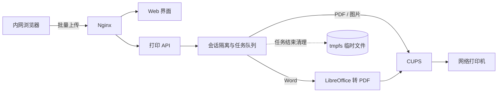

# 打印助手 Print Assistant

> 把办公室里“逐个打开文件、反复选择打印机”的重复操作，变成一次批量提交。

[](LICENSE)
[](https://www.docker.com/)
[](https://openprinting.github.io/cups/)
[](package.json)

打印助手是一款面向办公内网的开源批量打印 Web 应用。用户可以在浏览器中一次选择
Word、PDF、JPEG 或 PNG 文件，统一设置打印机、黑白/彩色和份数，然后查看转换、排队
与打印状态。服务端直接读取真实的 CUPS 打印队列，不内置演示打印机或假数据。

适合行政、人事、财务、档案室、门店和制造现场等需要集中打印资料的场景。

## 产品亮点

| 能力 | 说明 |
| --- | --- |
| 批量提交 | 支持拖放或多选，默认单次最多 50 个文件、单文件 100 MB |
| 真实打印机 | 自动发现 CUPS 网络打印队列，不展示演示设备或伪造状态 |
| 统一设置 | 支持选择打印机、记忆默认打印机、黑白/彩色和 1–99 份 |
| 进度可见 | 展示上传、转换、排队、打印、完成与失败状态，支持取消任务 |
| 多用户隔离 | 每个浏览器会话使用独立随机 Cookie，任务和历史相互不可见 |
| 不留存原件 | 临时文件存放在容器 `tmpfs`，任务结束后立即清理 |
| 一键部署 | 内置 Docker Compose、Nginx 和部署脚本，可在内网服务器快速上线 |

## 工作流程



- Web 界面负责文件选择、打印设置、进度与历史展示。
- 打印 API 负责会话隔离、并发队列、格式转换和任务清理。
- Word 文件由 LibreOffice 无界面转换为 PDF；PDF 与图片直接交给 CUPS。
- “完成”以 CUPS 队列不再报告未完成任务为准，具体打印机未必提供逐页出纸进度。

## 快速部署

### 环境要求

- 可访问办公打印网络的 Linux 服务器
- Docker Engine 与 Docker Compose 插件
- 以下打印环境之一：
  - 服务器本机已配置 CUPS，`lpstat -p -d` 能看到打印机；或
  - 一台允许服务器访问的远程 CUPS 打印服务器

### 一键启动

```bash
git clone https://github.com/HiveWang/print-assistant.git
cd print-assistant
./deploy.sh
```

部署脚本会自动识别 `/var/run/cups/cups.sock`。启动后访问：

```text
http://服务器IP:8080
```

需要修改端口、远程 CUPS 地址、队列位置或会话时长时：

```bash
cp .env.example .env
```

编辑 `.env` 后再次运行 `./deploy.sh`。

### 连接远程 CUPS

在 `.env` 中填写：

```text
CUPS_SERVER=10.10.10.20:631
```

本机 CUPS 模式可通过以下命令检查打印队列和驱动选项：

```bash
lpstat -p -d
lpoptions -p <打印队列名> -l
```

## 文件、会话与隐私

- 文件内容仅在任务处理期间存在于内存文件系统，成功、失败和取消都会进入清理流程。
- 历史记录只保存文件名、大小、打印设置和结果，不提供文件预览、下载或读取接口。
- 历史保存在服务进程内存中，默认清理 8 小时无活动会话，服务重启后清空。
- 同时打开页面的用户拥有不同临时会话，彼此看不到任务和历史。
- 会话隔离不等同于账号认证；共用电脑时建议使用不同浏览器配置文件或无痕窗口。
- 如需实名审计，可在 Nginx 前接入企业统一身份认证或内网访问网关。

## 能力边界

- `.doc` 与 `.docx` 的版式转换依赖 LibreOffice，复杂字体或宏文档可能与 Microsoft Word
  的渲染结果存在差异。
- 颜色参数使用 IPP 标准 `print-color-mode`。部分老式驱动需要在 CUPS 中设置队列默认值，
  或在 `server/index.mjs` 中补充厂商 PPD 选项。
- 当前历史为会话级内存数据，不适合作为长期审计日志。
- 项目不提供用户账号、计费、配额或内容审核能力，建议仅部署在可信办公内网。

## 本地开发

要求 Node.js 22.13 或更高版本。

```bash
npm install
npm run dev
```

开发预览端口为 `3000`，真实打印接口端口为 `8787`，网页会自动代理 `/api/`
请求。没有可用 CUPS 队列时，页面会明确显示“未发现打印机”。

常用检查：

```bash
npm run lint
npm test
```

## 运维命令

```bash
# 查看容器状态
docker compose ps

# 查看打印服务日志
docker compose logs -f api

# 停止服务
docker compose down
```

## 参与贡献

欢迎提交 Issue、功能建议和 Pull Request。开始开发前请阅读
[CONTRIBUTING.md](CONTRIBUTING.md)。提交问题时请勿附带真实打印文件、内部打印机地址、
账号凭据或其他办公网敏感信息。

## 开源许可

本项目基于 [MIT License](LICENSE) 开源。你可以自由使用、修改和分发，但软件按现状提供，
不附带任何形式的担保。
